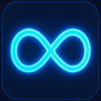
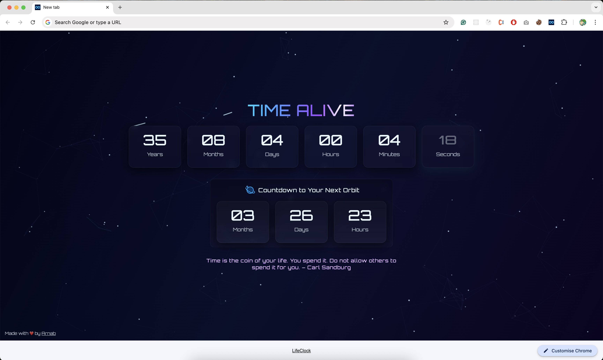
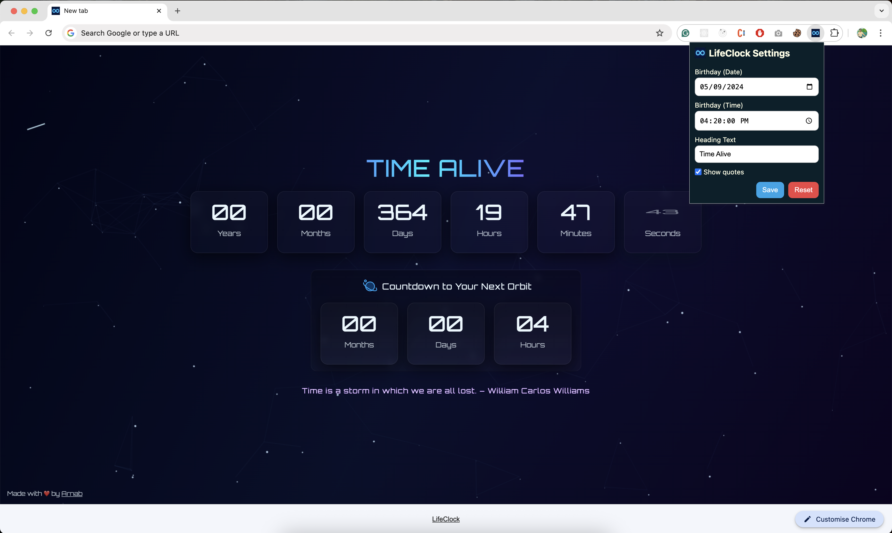

#  LifeClock

LifeClock is a **cosmic, interactive new tab Chrome extension** that shows your exact age and countdown to your next birthday—down to the seconds—along with inspiring time-related quotes.

It’s a fun, visual way to stay connected to time and your milestones!

---

## Features

- **Live Age Display:** See your age in **years, months, days, hours, minutes, and seconds**.
- **Next Birthday Countdown:** Count down to your next birthday with precision.
- **Inspirational Quotes:** Short, punchy quotes about time, displayed dynamically.
- **Cosmic Dynamic Background:** Interactive, animated visuals for a lively new tab.
- **Easy Settings:** Enter your birth date and time to personalize your experience.

---

## Installation (Team Use)

1. Clone this repository: `git clone https://github.com/arnab003/LifeClock.git`
2. Open Chrome (or Edge) and go to: `chrome://extensions/`
3. Enable **Developer Mode** in Chrome.
4. Click **Load unpacked** and select the **LifeClock** folder.
5. Open a **new tab** to see LifeClock in action! 🎉

---

## Screenshots / Demo

---

## Feedback & Sharing

If you’d like to try it or have suggestions, **do let me know**! I’d love to share it and improve it together.

---

## Credits

Made with ❤️ by [Arnab](https://www.linkedin.com/in/arnab-saha-85907747/)

---

## License

This project is licensed under the MIT License — see the [LICENSE](LICENSE) file for details.
